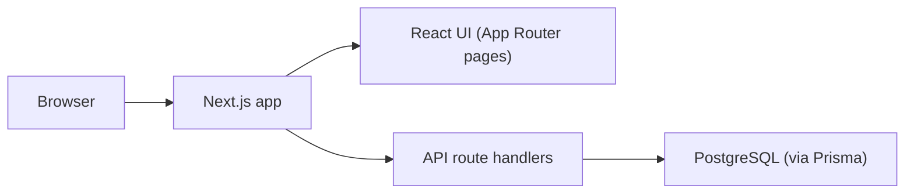

## Architecture overview

### Purpose and scope

This application is a video annotation and collaboration tool. It allows users to view videos and attach time-ranged comments, using a modern React/Next.js frontend backed by PostgreSQL via Prisma. This document describes the high-level architecture, technology choices, and how the main files map to responsibilities.

### System overview

At a high level, the system is a single Next.js 14 application that serves both HTML pages and JSON APIs, backed by a PostgreSQL database:

- The **browser** renders React UI pages and interacts with the video player and annotation features.
- The **Next.js app** (`app/` directory) handles routing, server-side rendering, and API requests.
- **API route handlers** under `app/api/` expose JSON endpoints for videos and comments.
- **PostgreSQL**, accessed through **Prisma**, stores video metadata and time-based comments.

### Tech stack and rationale

- **Next.js 14 (App Router) + React 18**
  - Provides server-side rendering and streaming, as well as client-side interactivity where needed.
  - File-based routing in `app/` keeps page and API structure easy to navigate.
  - Main entry points:
    - `app/layout.tsx`: Root layout, global styles, and shell.
    - `app/page.tsx`: Home page listing available videos.
    - `app/videos/[videoId]/page.tsx`: Per-video page that fetches a video and its comments.
- **TypeScript + ESLint**
  - Strict typing improves correctness and refactor safety across both frontend and backend.
  - Central configuration in `tsconfig.json` with `strict: true` encourages explicit types.
  - ESLint (via `eslint-config-next`) enforces consistent, framework-appropriate patterns.
- **Tailwind CSS**
  - Utility-first CSS accelerates layout and styling without introducing a heavy design system.
  - Used throughout `app/layout.tsx`, `app/page.tsx`, and UI components (e.g. card and grid classes) to keep styles close to markup.
- **Prisma + PostgreSQL**
  - Prisma provides a type-safe ORM with schema-as-code in `prisma/schema.prisma`.
  - PostgreSQL is a robust, widely used relational database suitable for enterprise workloads.
  - Database access is centralized through a Prisma client (imported from `@/lib/db`) to enforce consistent data access patterns.
- **Native HTML5 video**
  - The app wraps the browser’s `<video>` element in `components/VideoPlayer.tsx` instead of using a heavyweight third-party player.
  - This keeps the bundle smaller and simpler while still allowing custom controls and integration with time-based annotation features.

### High-level routing and component structure

- **Frontend pages (server components)**
  - `app/page.tsx`
    - Fetches videos from the database (via Prisma) and renders a list of available videos.
  - `app/videos/[videoId]/page.tsx`
    - Parses the `videoId` route parameter.
    - Loads the selected `Video` record and its associated `Comment` records.
    - Maps database entities into serializable `video` and `initialComments` props.
    - Renders the client-side `VideoPageShell` with those props.

- **Client-side feature shell**
  - `app/videos/[videoId]/VideoPageShell.tsx`
    - A client component that orchestrates the video player, time-based controls, and comments.
    - Holds UI state such as:
      - `currentTime` and `duration` for the active video.
      - `comments` for the current video.
      - Selected time ranges and the currently selected comment.
    - Connects user interactions to video playback by:
      - Passing `onTimeUpdate` and `onDurationChange` to `VideoPlayer`.
      - Implementing `handleSeek` to control playback time via `videoRef.current.currentTime`.
      - Wiring `TimeBar` callbacks (`onSeek`, `onRangeSelected`) to seek and select time ranges.
    - Handles comment creation via `CommentForm`, posting to `/api/videos/[videoId]/comments`.

- **Core UI components**
  - `components/VideoPlayer.tsx`
    - Thin wrapper around a `<video>` element.
    - Accepts a `videoRef` so parent components can control playback programmatically.
    - Emits `onTimeUpdate` and `onDurationChange` callbacks to keep UI state in sync with playback.
  - `components/TimeBar.tsx`
    - Visualizes the video duration, current time, and comment ranges.
    - Allow users to seek to different points and select time ranges for annotations.
  - `components/CommentForm.tsx` and `components/CommentList.tsx`
    - `CommentForm` captures comment text bound to a selected time range.
    - `CommentList` renders existing comments and allows selecting a comment to jump to its start time.

- **API routes**
  - `app/api/videos/route.ts`
    - Lists videos with metadata (id, title, description, `sourceUrl`, `durationSeconds`) for UI use or external clients.
  - `app/api/videos/[videoId]/route.ts`
    - Returns metadata for a single video, identified by `videoId`.
  - `app/api/videos/[videoId]/comments/route.ts`
    - `GET`: Returns all comments for a video, ordered by `startSeconds` and `createdAt`.
    - `POST`: Validates input and creates new comments for a given video.

### Data model

The data model is defined in `prisma/schema.prisma` and centers on two entities:

- `Video`
  - Key fields:
    - `id`: Primary key.
    - `title`, `description`: Metadata for display.
    - `sourceUrl`: URL where the actual video file is hosted (e.g. CDN, object storage, or video platform).
    - `durationSeconds`: Optional cached duration of the video in seconds.
    - `createdAt`: Timestamp of creation.
  - Relationships:
    - `comments`: One-to-many relationship to `Comment` records.

- `Comment`
  - Key fields:
    - `id`: Primary key.
    - `videoId`: Foreign key referencing the parent `Video`.
    - `startSeconds`, `endSeconds`: Define the time range within the video the comment refers to.
    - `text`: The comment body.
    - `createdAt`, `updatedAt`: Timestamps for auditing and ordering.
  - Relationships and behavior:
    - Belongs to a single `Video` (`videoId`).
    - Uses `onDelete: Cascade` so comments are automatically removed when their parent video is deleted.

These fields support time-based annotation by allowing each comment to be tied to a precise interval within the video. UI components such as `TimeBar` and `CommentList` use `startSeconds` and `endSeconds` to render and navigate between annotations.

### Runtime boundaries and responsibilities

- The Next.js application is responsible for:
  - Rendering the user interface and orchestrating video playback and annotation features.
  - Exposing JSON APIs for reading and writing video metadata and comments.
  - Enforcing basic validation and shaping data for the frontend.
- The PostgreSQL database stores:
  - Video records and their metadata.
  - Comment records associated with videos, including their time ranges.
- Raw video assets are **not** stored in the application or database:
  - The `Video.sourceUrl` field points to the location of the media (e.g. object storage + CDN or a third-party video platform).
  - This keeps the application focused on metadata and collaboration concerns while allowing the media pipeline and hosting strategy to evolve independently.

