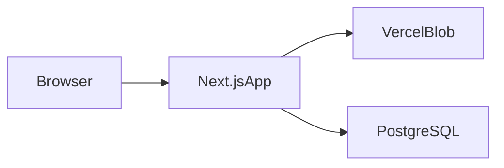

# Architecture

## Overview

The app is a single Next.js 14 service. It renders the UI, handles uploads and comment APIs, stores video files in Vercel Blob, and stores metadata/comments in PostgreSQL via Prisma.

## Main Flow

1. `app/page.tsx` and `app/videos/page.tsx` list video files from the Blob `videos/` prefix.
2. `app/api/blob/upload/route.ts` uploads a file to Blob and creates a `Video` row with a generated `publicId`.
3. `app/videos/[videoId]/page.tsx` resolves `videoId` as either a stored `publicId` or a raw pathname, then opens the player.
4. `app/videos/watch/[filename]/FileVideoPageShell.tsx` loads and creates comments through `app/api/blob/comments/route.ts`.

## Important Files

- `app/videos/[videoId]/page.tsx`: server entry for the annotation page.
- `app/videos/[videoId]/VideoPageShell.tsx`: client shell for playback, range selection, and comments.
- `components/VideoPlayer.tsx`: wraps `<video>` and handles the private-blob preload workaround.
- `components/TimeBar.tsx`: ruler with ticks, seek bar, range selection, current-time cursor (white bar + inverted arrow), and 0:00/duration labels.
- `app/api/blob/upload/route.ts`: Blob upload plus `Video` record creation.
- `app/api/blob/comments/route.ts`: pathname-keyed comment read/write API.
- `app/api/blob/stream/route.ts`: playback proxy for private Blob mode.
- `lib/blob.ts`: Blob listing, metadata, and playback URL helpers.
- `lib/video-upload.ts`: file validation, size limit, pathname building, and public ID helpers.

## Data Model

Current runtime tables in `prisma/schema.prisma`:

- `Video`: display name, `publicId`, Blob `pathname`, Blob `sourceUrl`, and optional metadata.
- `Comment_blob`: comment ranges keyed by Blob pathname.

Current UI behavior uses `Video` and `Comment_blob`. The older `Comment` model is still present in the schema, but the active Blob-backed flow does not read from it.

## Playback Notes

- `BLOB_ACCESS=public`: use direct Blob URLs.
- `BLOB_ACCESS=private`: use `/api/blob/stream`.
- For private playback, `components/VideoPlayer.tsx` fetches the full file and swaps to a blob URL so browser seeking still works.

## Legacy Paths To Review

- `lib/blob-storage.ts`: appears unused.
- `prisma/seed.ts`: still targets the older static sample-video path.
- `app/videos/watch/[filename]/page.tsx`: manual static-file route, not linked from the main UI.

