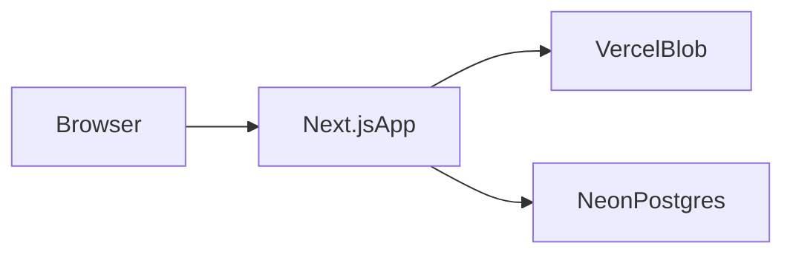

# Architecture

## Overview

The app is a single Next.js 14 service. It renders the UI, handles uploads and comment APIs, stores video files in Vercel Blob, and stores metadata/comments in Neon PostgreSQL via Prisma 6.

```mermaid
flowchart LR
  browser[Browser] --> nextApp["Next.jsApp"]
  nextApp --> blobStore["VercelBlob"]
  nextApp --> neon["NeonPostgres"]
```

## Database connectivity

- **Runtime:** `lib/db.ts` instantiates `PrismaClient` with `@prisma/adapter-neon` (`PrismaNeon`), using `DATABASE_URL` over Neon's HTTP/WebSocket driver. This avoids requiring PostgreSQL wire protocol (port 5432) in restricted environments.
- **Migrations / CLI:** `prisma/schema.prisma` still reads `DATABASE_URL` for `prisma migrate deploy`, `prisma studio`, etc. Run those from a machine that can reach Neon on the wire (normal local dev is fine).
- **Requirement:** `DATABASE_URL` must be a Neon connection string (pooled URL recommended for app queries). Local `localhost` Postgres URLs are not supported by the runtime adapter.
- **Node:** `24.x` per `package.json` `engines` and `.nvmrc` (Vercel builds/functions support 20.x–24.x; Node 26 is not available for standard deployments).
- **Cloud agents:** `AGENTS.md` (bootstrap checklist), `.cursor/sandbox.json` (outbound allowlist for Neon/Blob/npm), `.env.example`.

## Main Flow

1. `app/page.tsx` and `app/videos/page.tsx` list video files from the Blob `videos/` prefix.
2. `app/api/blob/upload/route.ts` uploads a file to Blob and creates a `Video` row with a generated `publicId`.
3. `app/videos/[videoId]/page.tsx` resolves `videoId` as either a stored `publicId` or a raw pathname, then opens the player.
4. `app/videos/watch/[filename]/FileVideoPageShell.tsx` loads and creates comments through `app/api/blob/comments/route.ts`.

## Important Files

- `app/videos/[videoId]/page.tsx`: server entry for the annotation page.
- `app/videos/[videoId]/VideoPageShell.tsx`: client shell for playback, range selection, and comments.
- `components/VideoPlayer.tsx`: wraps `<video>` and handles the private-blob preload workaround.
- `components/TimeBar.tsx`: combined timeline UI (ruler + time bar), seek cursor, and drag range selection.
- `app/api/blob/upload/route.ts`: Blob upload plus `Video` record creation.
- `app/api/blob/comments/route.ts`: pathname-keyed comment read/write/delete API.
- `app/api/blob/stream/route.ts`: playback proxy for private Blob mode.
- `lib/blob.ts`: Blob listing, metadata, and playback URL helpers.
- `lib/db.ts`: Prisma singleton with Neon HTTP adapter.
- `lib/video-upload.ts`: file validation, size limit, pathname building, and public ID helpers.

## Data Model

Current runtime tables in `prisma/schema.prisma`:

- `Video`: display name, `publicId`, Blob `pathname`, Blob `sourceUrl`, and optional metadata.
- `Comment_blob`: comment ranges keyed by Blob pathname. Optional `parentId` creates threaded replies; replies store the same `startSeconds` / `endSeconds` as their parent so the timeline can show one marker per top-level range.

Current UI behavior uses `Video` and `Comment_blob`. The older `Comment` model is still present in the schema, but the active Blob-backed flow does not read from it.

## Playback Notes

- `BLOB_ACCESS=public`: use direct Blob URLs.
- `BLOB_ACCESS=private`: use `/api/blob/stream`.
- For private playback, `components/VideoPlayer.tsx` fetches the full file and swaps to a blob URL so browser seeking still works.
- `components/TimeBar.tsx` exposes one shared horizontal scale for ruler ticks and the seek bar so drag-to-select can begin on either surface and end anywhere on the page.

## CI

GitHub Actions (`.github/workflows/ci.yml`) on push/PR to `next`: **lint**, **typecheck**, and a **test** stub (always green; no real unit tests). No deploy step, no `next build`, no Prisma migrate in CI.

## Legacy Paths To Review

- `lib/blob-storage.ts`: appears unused.
- `prisma/seed.ts`: still targets the older static sample-video path.
- `app/videos/watch/[filename]/page.tsx`: manual static-file route, not linked from the main UI.

